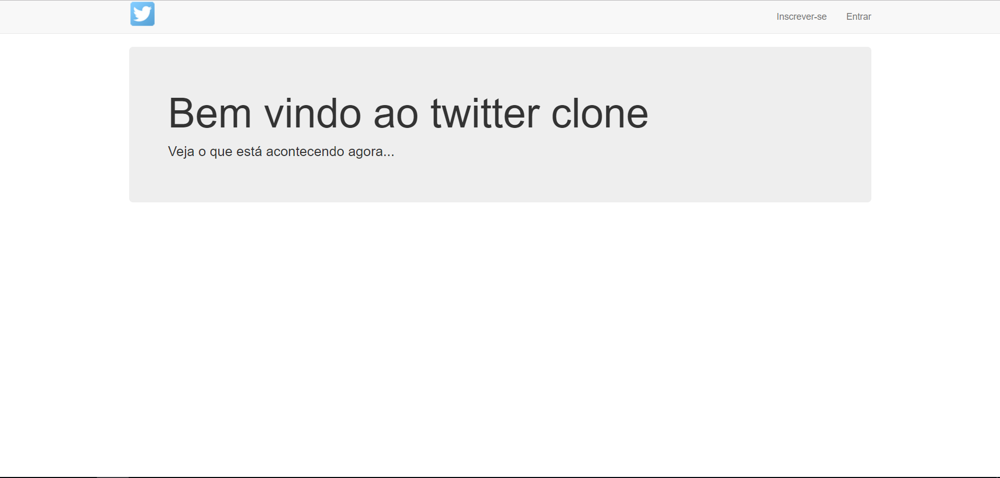
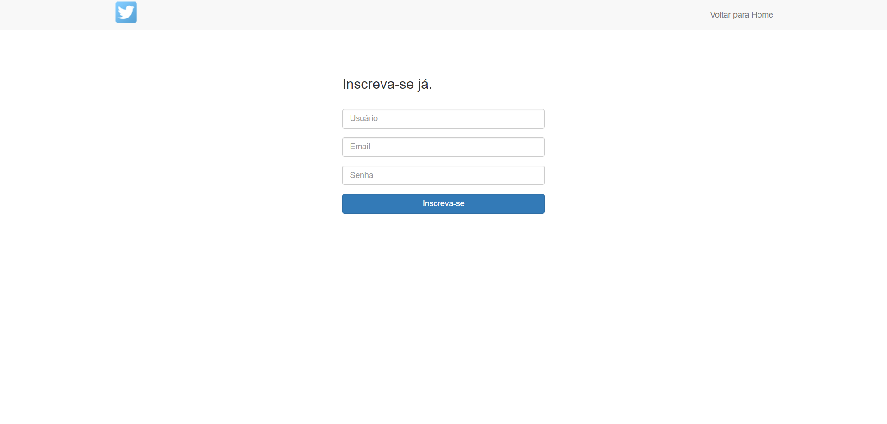
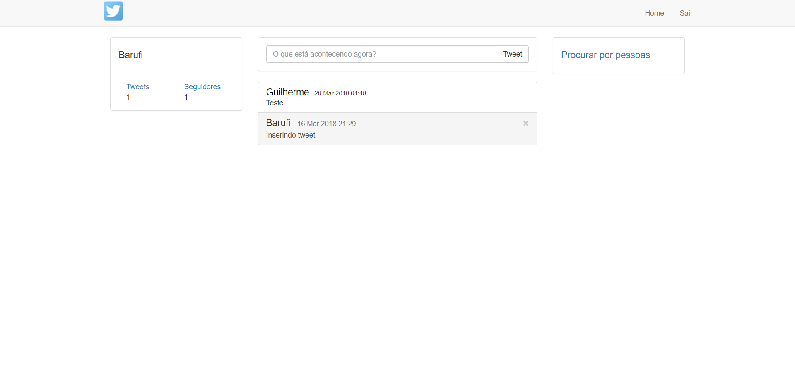
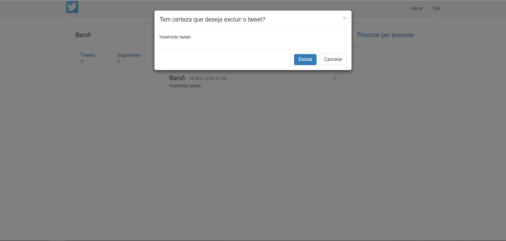
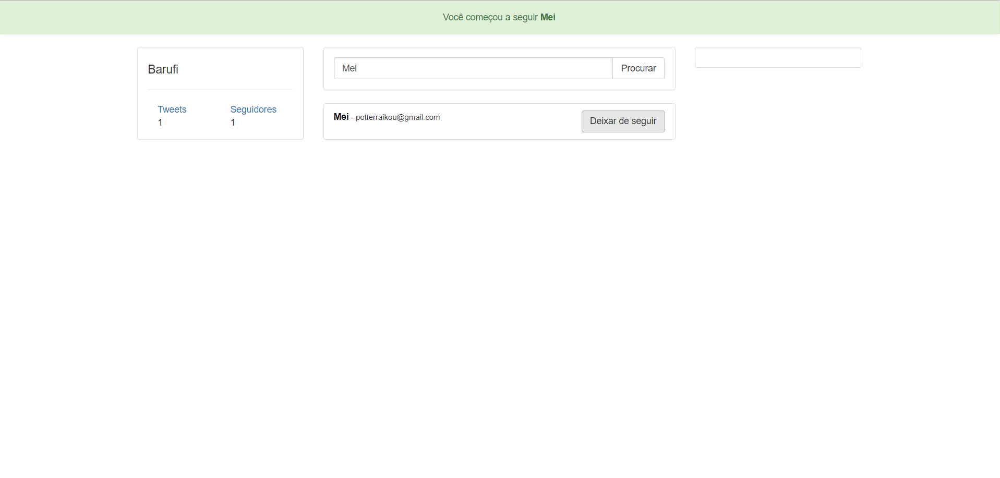

# TwitterClone
Simple project that reproduces the Twitter functionalities, developed while I was learning PHP.

          
<br>
     

### Prerequisites

To easily run the project, I recommend that you install:
* [**XAMPP**](https://www.apachefriends.org/)

### Running the project

```
1. Install XAMPP (the used components are only Apache, MySQL, PHP and PHPMyAdmin)
2. Download the files
3. Extract .zip file and put files on "XAMPP_DIRECTORY/htdocs" (commonly "C:/xampp/htdocs")
4. Start Apache server and MySQL server on XAMPP control panel
5. Open "http://localhost/phpmyadmin/" on your browser
6. Click on "Import" menu item
7. Select the file "twitter_clone.sql" then click "Execute"
8. Open "http://localhost/twitter_clone/" on your browser
```
